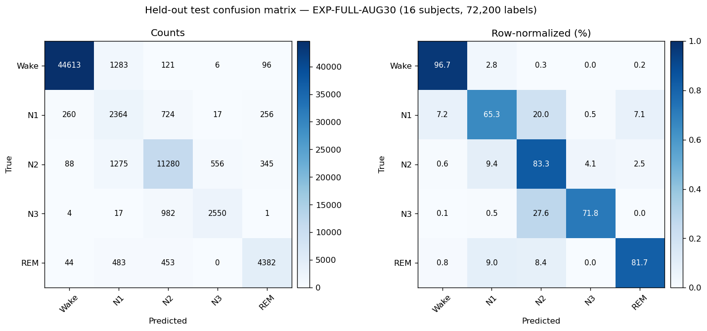

# NeuroSleep — Validated Results
## Authoritative Metrics from Canonical Experiments

> **Rule:** All metrics in this file are generated from canonical result artifacts. Do not manually edit numbers.

---

## Final Submission Run: EXP-FULL-AUG30 (project freeze, Sept 2026)

**Experiment:** Final Full-Dataset Person-Level Holdout Experiment — Notebooks 01→05
end-to-end on the complete Sleep-EDF Expanded v1.0.0 corpus  
**Dataset:** 197 recordings / 100 subjects (age-effects 153/78 + sleep-telemetry 44/22),
SHA-1-verified against the official MNE record tables  
**Split:** Person-level 70/15/15 per cohort (seed 42) — train 69 / val 15 / test 16 subjects  
**Config:** 10×30 s context, train stride 5 / eval stride 10 (gap-aware, no tail padding),
batch 8, ≤30 epochs with early stopping (patience 5) on best validation **Macro F1**,
train-only augmentation, AdamW 3e-4, wd 1e-4, grad clip 1.0, cosine + 10% warmup,
log-frequency class weights  
**Checkpoint:** `artifacts/final/EXP-FULL-AUG30_seed42.pt` — verified and promoted to
`artifacts/neurosleep_model_best.pt`  
**Results:** `results/final/final_metrics.json` + `results/final/*`  
**Audit:** `FINAL PROTOCOL AUDIT PASSED` (197/100 scope, batch 8, ≤30 epochs, selection
metric val_macro_f1, augmentation, manifest hash, disjoint splits, strict load,
probabilities → 1, metrics regenerated from predictions)

### Test Metrics (16 held-out test subjects, 7,220 stride-10 windows = 72,200 epochs)

| Metric | Value |
|--------|-------|
| Accuracy | 0.9048 |
| Cohen's κ | 0.8283 |
| Macro F1 | 0.7899 |
| Weighted F1 | 0.9089 |
| Macro Geometric Mean | 0.7911 |
| CPU latency (measured) | 8.94 ms per 5-minute window |
| Best validation | Macro F1 0.7645 @ epoch 12 (early-stopped at 17/30) |

### Per-Class Results

| Stage | Precision | Recall | F1 |
|-------|-----------|--------|-----|
| Wake | 0.991 | 0.969 | 0.980 |
| N1 | 0.451 | 0.647 | 0.532 |
| N2 | 0.831 | 0.834 | 0.832 |
| N3 | 0.816 | 0.717 | 0.763 |
| REM | 0.858 | 0.827 | 0.842 |

> **Note:** Evaluation is a fixed person-level holdout — every test epoch is scored exactly
> once on non-overlapping stride-10 windows. The numbers are **not directly comparable** to
> the historical tiers below (different cohort, split, and evaluation semantics). This run is
> the project's September 2026 submission benchmark, generated by the notebook chain itself.

### Fit Diagnosis — train/val/test gap (overfitting check)

Frozen checkpoint evaluated on clean stride-10 windows of all three splits, augmentation
off, no retraining (Notebook 05 §14; artifact `results/final/fit_diagnosis.json`):

| Split | Windows | Labels | Accuracy | κ | Macro F1 | N1 F1 |
|-------|--------:|-------:|---------:|----:|---------:|------:|
| Train | 31,285 | 312,850 | 0.9250 | 0.8653 | 0.8328 | 0.627 |
| Val | 7,008 | 70,080 | 0.8737 | 0.7782 | 0.7645 | 0.521 |
| Test | 7,220 | 72,200 | 0.9048 | 0.8283 | 0.7899 | 0.532 |

**Gaps:** train−val **+5.12 pp**, train−test **+2.01 pp**, val−test **-3.11 pp**
(test above val). Weakest class on train: N1 (F1 0.627).

**Verdict (from artifact):** mild, controlled generalization gap (5.12 pp train−val) —
train accuracy 0.9250 is not saturated and the weakest train class (N1, F1 0.627) is weak
even on training data, so errors are dominated by label ambiguity, not memorization.
Test (0.9048) exceeding val (0.8737) confirms no systematic degradation on unseen subjects.

**Confusion matrix (held-out test subjects):**

> Generated by Notebook 05 §7 (`results/final/confusion_matrix.png`); raw counts in
> `results/final/confusion_matrix.csv`.

---

## Historical Standalone Run: EXP-STANDALONE-99K (Notebooks 01→05, supervised CE)

**Experiment:** Notebooks 01→05 end-to-end, supervised class-weighted CE,
exhibition 70/15/15 subject split  
**Config:** seed 42, AdamW 3e-4, 20 epochs, batch 16, stride 5  
**Checkpoint:** `artifacts/standalone_99k/student_99477_best.pt`  
**Results:** `results/standalone_99k/`

### Test Metrics (15 held-out subjects, all-position protocol, 74,860 epochs)

| Metric | Value |
|--------|-------|
| Accuracy | 0.9057 |
| Cohen's κ | 0.8080 |
| Macro F1 | 0.7490 |
| Weighted F1 | 0.9115 |
| Macro Geometric Mean | 0.7808 |
| CPU latency (measured) | 6.2 ms/batch |
| Best validation | κ 0.8274 @ epoch 18/20 |

### Per-Class F1

| Stage | F1 |
|-------|-----|
| Wake | 0.978 |
| N1 | 0.477 |
| N2 | 0.823 |
| N3 | 0.705 |
| REM | 0.762 |

> **Note:** This run uses the all-position protocol; its numbers are
> comparable within EXP-STANDALONE-99K only. The deployable checkpoint is
> `artifacts/standalone_99k/student_99477_best.pt`.

---

## Quarantined Results (Reference Only)

### Adaptation Study (Frozen / LoRA / Full-FT)
**Status:** QUARANTINED — Contaminated base checkpoint + record-level folds  
**Location:** `results/quarantine/legacy_adaptation/`

| Method | Trainable Params | Accuracy | κ | Macro F1 |
|--------|----------------:|---------:|---:|---------:|
| Frozen Base | 0 (0%) | 87.1% ± 3.6% | 0.738 ± 0.077 | 0.673 ± 0.074 |
| LoRA CNN+Head (r=8) | 1,448 (1.43%) | 83.6% ± 3.7% | 0.693 ± 0.057 | 0.674 ± 0.045 |
| Full Fine-Tuning | 99,477 (100%) | 87.7% ± 2.7% | 0.763 ± 0.043 | 0.730 ± 0.037 |

> **Warning:** These results are retained only for internal like-for-like comparison. They MUST NOT be reported as valid person-generalization estimates.

---

## Model Card Metrics (Hugging Face)

The following metrics are the canonical values for the Hugging Face model card:

| Field | Value |
|-------|-------|
| Model | NeuroSleep Model |
| Parameters | 99,477 |
| Dataset | Sleep-EDF Expanded (full corpus: 197 recordings, 100 persons) |
| Protocol | Person-level 70/15/15 holdout (seed 42), stride-10 all-position evaluation |
| Accuracy | 90.48% |
| Cohen's κ | 0.8283 |
| Macro F1 | 0.7899 |
| Weighted F1 | 0.9089 |
| Per-Class F1 (Wake/N1/N2/N3/REM) | 0.980 / 0.532 / 0.832 / 0.763 / 0.842 |

---

## Source Artifacts

All metrics above are derived from:

1. `results/final/final_metrics.json` — Final submission run (EXP-FULL-AUG30, primary)
2. `results/research/EXP-BENCH-PERSON/` — Historical person-level CV benchmark archive (results not published)
3. `results/standalone_99k/` — Historical standalone notebook run (deployable checkpoint)
4. Quarantined adaptation numbers are recorded in `docs/adaptation.md` only
   (evidence files removed in the September 2026 cleanup)

Generated by: `scripts/summarize_person_benchmark.py` and the notebooks
(final run metrics regenerated end-to-end by Notebooks 04→05)
